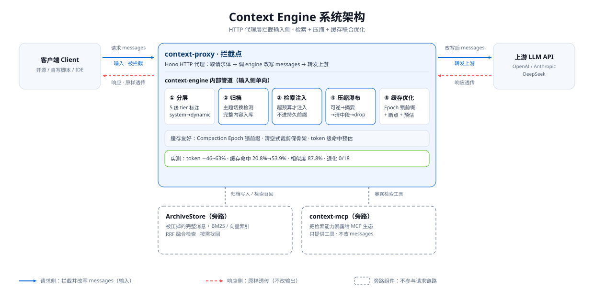

# Context Engine

> LLM 上下文管理代理 —— 拦截 AI 编程工具与 LLM API 之间的请求，在不损失回答质量的前提下压缩上下文、优化前缀缓存命中。

## 解决什么问题

长对话 / 大代码库场景下，上下文持续膨胀导致三个问题：**token 成本飙升、前缀缓存命中率下降、模型注意力分散**。本项目的思路不是简单截断，而是把上下文当作一个受预算约束、需分层管理的资源。

## 核心结果（20 轮受控回放，budget=8000，DeepSeek）

| 指标 | 结果 |
|---|---|
| 累计输入 token | 180602 → 96511（**-46.6%**） |
| 末轮输入 token | 19672 → 6800（**-65.4%**） |
| 语义相似度（LLM-as-Judge） | 87.8 / 100 |
| 需求覆盖率 | 95.6% → 90.3%（-5.3pp） |
| 严重退化 | 0 / 18 |
| 截断策略缓存命中预估 | 删除式 20.8% vs 清空式 53.9%（策略对比） |

实验方法与逐轮数据见 [`reports/`](./reports)（benchmark、消融、accuracy-eval）。

## 架构



```
┌─────────────┐     ┌──────────────┐     ┌──────────┐
│   Client    │────▶│ context-proxy│────▶│  LLM API │
│(AI 编程工具) │     │ 拦截·改写·转发 │     └──────────┘
└─────────────┘     └──────┬───────┘
                           ▼
                    ┌──────────────┐
                    │context-engine│  核心算法库
                    └──────────────┘
```

| 包 | 职责 |
|---|---|
| `@context/engine` | 核心算法：分层、归档、检索、压缩瀑布、缓存优化、预算管理 |
| `@context/proxy` | HTTP 代理：OpenAI `/v1/chat/completions` + Anthropic `/v1/messages` 双协议拦截，**输入改写、输出透传** |
| `@context/mcp` | MCP server：通过 stdio 暴露 `search_archive` |

## 引擎五步管线

1. **分层** —— messages 按稳定度切分为 system / tools / rules / history / dynamic 五层
2. **归档** —— ModuleTracker 检测主题切换，旧模块内容写入 ArchiveStore
3. **检索注入** —— 下一轮请求按需从 ArchiveStore 召回相关内容（关键词 / 向量 / RRF 混合）
4. **压缩瀑布** —— 无损归一化 → LLM 结构化摘要 → 相关性感知 Middle 清空（保留 hint）
5. **缓存优化** —— 稳定前缀保护 + Anthropic cache_control 断点注入 + 命中率预估

## 快速开始

```bash
pnpm install
pnpm build          # 构建三个包
pnpm test           # 运行 12 个测试套件（策略/归档/检索/断点）
pnpm demo           # 启动代理 (localhost:8787)
```

demo 客户端与效果评测需配置 `DEEPSEEK_API_KEY`（受控回放、LLM-as-Judge 评测见 `packages/context-proxy/src/demo-client.ts` 与 `packages/context-engine/src/__test__/accuracy-eval.ts`）。

## 评估方法

- **受控回放**：固定 20 轮对话历史，对比"直连 LLM"与"经过代理"两条链路的输入 token 与回答质量
- **LLM-as-Judge 校准**：位置交换 + 第三轮决胜，缓解 Judge 的位置与长度偏差
- **消融实验**：策略组合逐项拆解（见 `reports/ablation-*.md`）

## 项目结构

```
packages/
├── context-engine/        # 核心算法库
│   └── src/
│       ├── engine.ts      # 主流程（五步管线）
│       ├── compress/      # 无损归一化 / 语义折叠 / LLM 摘要
│       ├── retrieve/      # ArchiveStore / 混合检索 / tree-sitter repo map / PageRank
│       ├── cache.ts       # 命中率预估（逐条 + token 级前缀匹配）
│       └── __test__/      # 12 个测试套件 + benchmark + accuracy-eval
├── context-proxy/         # Hono 双协议代理 + demo 客户端
└── context-mcp/           # MCP server（search_archive）
```

## 更多文档

- [DESIGN.md](./DESIGN.md) —— 设计文档（类型系统、模块设计、benchmark 方案）
- [PROJECT_STATUS.md](./PROJECT_STATUS.md) —— 工程状态与里程碑
- [reports/](./reports) —— 基准测试、消融实验与评测报告

## MCP 使用

`@context/mcp` 通过 stdio 暴露 `search_archive` 工具。本阶段采用独立进程模式，启动时使用空的内存归档；它不会自动读取 `context-proxy` 的实时 session：

```bash
pnpm --filter @context/mcp build
node packages/context-mcp/dist/index.js
```

未来宿主应用若已有实时归档状态，可调用 `createMcpServer(archiveStore)` 复用同一个 `ArchiveStore`。这属于后续集成方向，本阶段不包含代理 session 生命周期接入。

## 路线图

- [x] 双协议代理 + 压缩瀑布 + 缓存优化
- [x] ArchiveStore 归档召回 + tree-sitter repo map
- [x] context-mcp：将归档检索能力封装为 MCP server（`search_archive`）
- [ ] 评测基准脚本开源整理 + 英文 README
